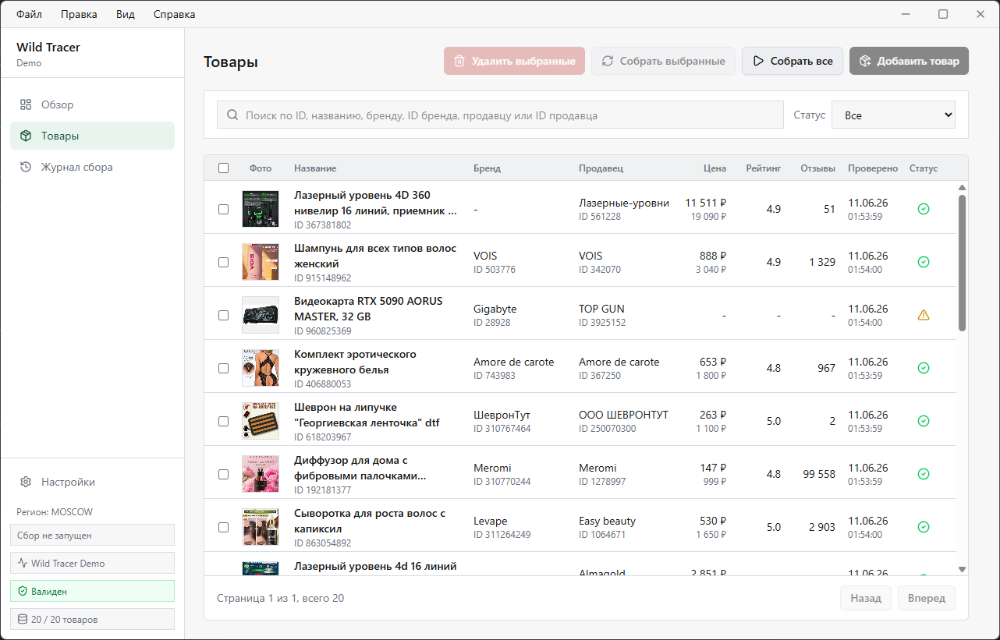

<p align="center">
  
</p>

# Wild Tracer

Wild Tracer - локальное desktop-приложение для Windows, которое помогает отслеживать и анализировать товары Wildberries.

Текущая публичная сборка: **Wild Tracer Demo**.

## Скачать

Последний установщик доступен на странице [GitHub Releases](https://github.com/rblv/wild-tracer/releases).

Публичные релизные файлы выпускаются в формате Windows x64 installer:

```text
Wild Tracer <edition>-<version>-win-x64.exe
Wild Tracer <edition>-<version>-win-x64.exe.sha256
```

## Редакции

- **Wild Tracer Demo** - доступна сейчас. Product-only demo с локальными ограничениями.
- **Wild Tracer Products** - планируемая платная product-only редакция.
- **Wild Tracer Market** - планируемая редакция с импортом продавцов и брендов.

## Документация

- [Установка](docs/install.md)
- [Ограничения Demo](docs/demo-limits.md)
- [Редакции](docs/editions.md)
- [Приватность](docs/privacy.md)
- [Решение проблем](docs/troubleshooting.md)
- [Получение токена](docs/get-token.md)

## Обратная связь

Публичный репозиторий для обратной связи:

https://github.com/rblv/wild-tracer-feedback

Не публикуйте в issues WB tokens, cookies, приватные данные аккаунта, локальные базы данных, логи с секретами или скриншоты с чувствительной информацией.

## Лицензия

Wild Tracer Demo является проприетарным программным обеспечением.

Установщик предоставляется бесплатно только для ознакомительного использования. Исходный код не публикуется, и лицензия на исходный код не предоставляется. Подробнее: [LICENSE.md](LICENSE.md).