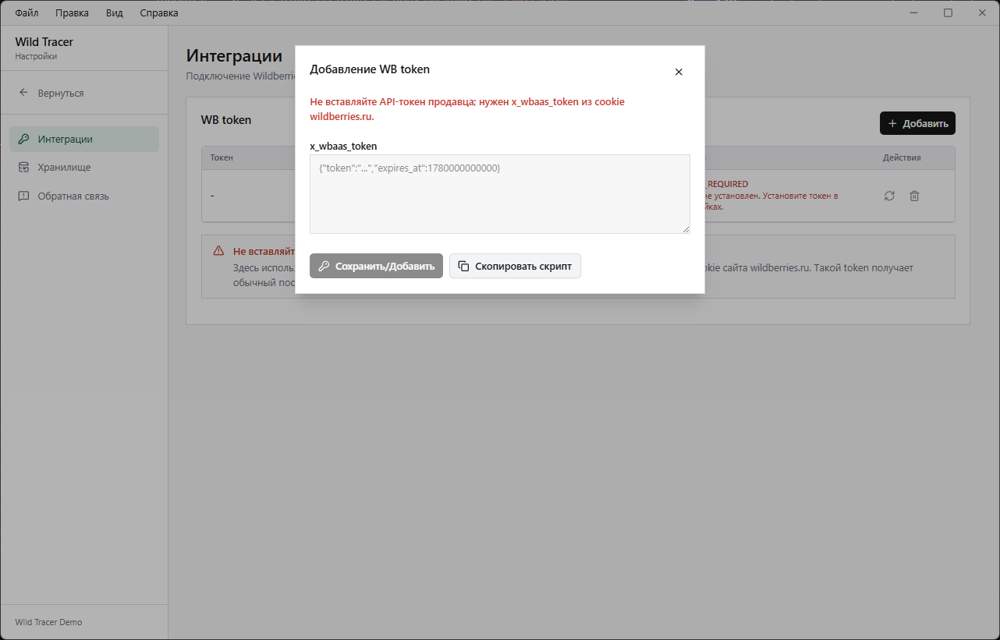

# Получение токена

## Важно

### **Это НЕ токен из панели продавца (seller.wildberries.ru)**

## Как использовать

1. Откройте https://www.wildberries.ru в браузере в режиме **инкогнито**, дождитесь полной загрузки(5-10 секунд)
2. Откройте DevTools (F12) → вкладка Console
3. Вставьте и выполните скрипт ниже
4. Скопируйте выведенную строку в настройки Wild Tracer

### Скрипт

```bash
cookieStore.get("x_wbaas_token").then((c) => {
  if (!c?.value) {
    console.warn("Токен не найден — откройте wildberries.ru и повторите");
    return;
  }
  const expiresAt = c.expires ?? (Date.now() + 14 * 24 * 60 * 60 * 1000);
  const expiresDate = new Date(expiresAt).toLocaleString("ru-RU");
  console.log("%cТокен найден! Истекает: " + expiresDate, "color:green;font-weight:bold");
  console.log("%c— Значение для настроек Wild Tracer (выделите строку ниже → ПКМ → Copy) —", "color:#888;font-style:italic");
  console.log(JSON.stringify({ token: c.value, expires_at: expiresAt }));
});
```
Скрипт можно получить из приложения, нажав кнопку "Скопировать скрипт"

